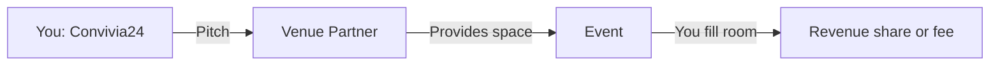

# Venue Partnership Implementation

The partnership with existing venues is **not a code feature** — it's a business process. There is no automated system; you reach out to venues manually and run events at their spaces.

## How It Works

### Step 1: Build Your List

- List 5–10 venues in Lagos (Victoria Island): hotels, upscale restaurants, coworking spaces
- Same for Abuja when ready
- Target: GM, Events Manager, or Business Development contact

### Step 2: Draft a One-Pager

Include:

- **Convivia24 vision**: "Where African business is done"
- **Target audience**: Operators, founders, diaspora returnees, executives
- **What you're proposing**: "Convivium at [Venue Name]" — curated dinners, deal rooms, or networking events
- **Your assets**: Brand, community (waitlist), curation
- **Their assets**: Space, F&B, operations
- **Model**: Revenue share or fixed fee per event

### Step 3: Reach Out

- Email or LinkedIn
- Propose a pilot: one dinner or one half-day event
- Use your waitlist count as proof of demand: "We have X people interested in Convivium events"

### Step 4: Run the Event

- Once a venue agrees, create an event page (e.g. `/events/the-table-lagos-march`)
- Use the inquiry form or a dedicated event signup to collect attendees
- Email your waitlist
- Run the event at the partner venue

### Event Types to Propose

| Event           | Venue Type              | Frequency  |
|----------------|-------------------------|------------|
| The Table      | Restaurant / hotel F&B  | Monthly    |
| Deal Rooms     | Hotel meeting rooms    | By booking |
| The Gathering  | Hotel ballroom / event  | Quarterly  |

## What Exists in Code Today

- **Waitlist** (`/api/waitlist`) — captures emails to show venue partners
- **Inquiry form** (`/inquire`) — for full inquiries (membership, stay, etc.)
- **Event landing page** — not yet built; add when you secure your first partner

## Next Steps When You Have a Partner

1. Add an event page: `/events/[slug]` with signup
2. Add an API route for event signups (or reuse inquiries with type "Event")
3. Email the waitlist when the event is live
